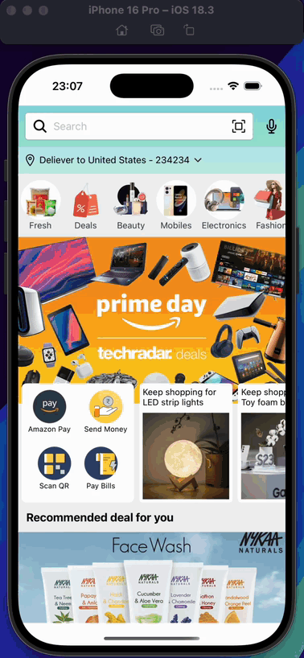
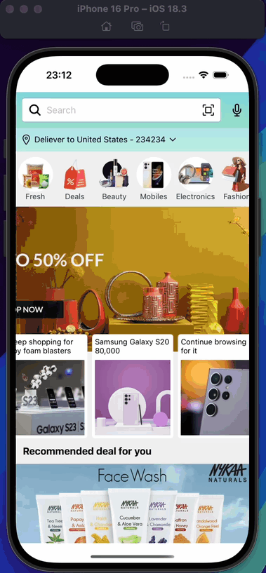

<h1>Amazon Clone App</h1>

This project is a clone of Amazon, an e-commerce application developed with React Native. Application consists of a home page and a products page. Users can view products, sales, campaigns and tools on the home page. They can view category products on the products page.

<h2>Used Technologies</h2>

<ul>

<li>@react-navigation/stack</li>
<li>@react-navigation/native</li>
<li>react-native-screens</li>
<li>@react-native-masked-view/masked-view"</li>
<li>react-native-gesture-handler</li>
<li>react-native-linear-gradient</li>
<li>react-native-swiper</li>
<li>react-native-vector-icons</li>

</ul>

<h1>Screen Gifs</h1>

